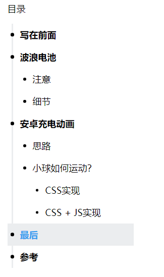

# 说明

这是一个文章目录组件，用于生成文章的目录，并附带平滑滚动和目录定位功能。

## 示例



# 快速开始

```shell
npm install --save article-catalogue
```

```vue
<template>
  <div>
    <div id="article" v-html="content" />
    <Catalogue selector="#article" />
  </div>
</template>

<script>
import Catalogue from 'article-catalogue'
export default {
  components: { Catalogue }
}
</script>
```


# 配置项

样式采用stylus，使用前请确保安装相应的依赖。默认配置一共三项，组件部分细节如下：

```javascript
export default {
    ···
	props: {
        selector: {
          type: String,
          required: true // 必须项，文章元素对应的选择器
        },
        title: {
          type: String,
          default: '目录'
        },
        asyncData: {
          type: Boolean,
          default: true
        }
	},
    ···
}
```

**关于`asyncData`配置项的说明**：一般来说，文章的内容都是通过`ajax`请求异步获取并渲染到页面上的，这意味着页面初始化时，目录组件是无法获取到dom元素的。以下是内部实现细节，通过父组件的`updated`钩子来触发目录组件的初始化。

```javascript
···
mounted () {
    if (this.asyncData) {
        this.$parent.$once('hook:updated', this.init)
    } else {
        this.init()
    }
}
···
```

当然，如果你的文章内容是同步数据（即dom节点在组件初始化时已经存在在页面中），那么您可以通过设置：`asyncData: ture`

```vue
<Catalogue selector="#article" :asyncData="false" />
```

当然，组件十分简单，总共不过200行代码，除去模板和样式，也许只有100行。如果您愿意，完全可以将组件从`node_modules`中拿出来自行修改。